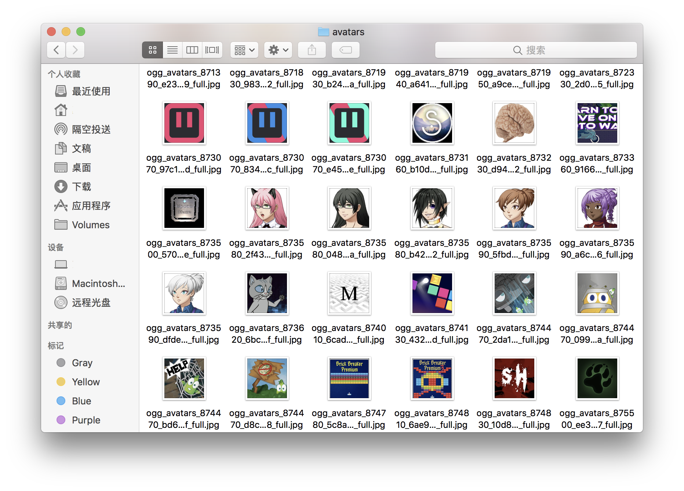

# SteamAvatar


A crawler that scrap the Steam avatars.
# Usage
- Update urls and download.

```bash
$ git clone -b dev git@github.com:2foil/SteamAvatar.git
$ cd SteamAvatar
$ pip3 install -r requirements.txt 
$ python scrap.py
$ python download.py
```
- Only download the scraped urls in avatar.sqlite.

```bash
$ git clone git@github.com:2foil/SteamAvatar.git
$ cd SteamAvatar
$ pip3 install -r requirements.txt 
$ python download.py
```
## Chinese Attention
Because of the China's Great Fire Wall, the Steam's site is blocked by it. So you should configue the porxy in ```proxy.py``` before you start scrape the urls.
For example, I use the socks proxy and I confugue it below.

```python 
# proxy.py 
my_proxies = {
	'http': 'socks5://127.0.0.1:1086', 
	'https': 'socks5://127.0.0.1:1086'
}
```
# Result


The avatars is saved at ```./avatars```
# Tech
- using python corotinue: async/await 
